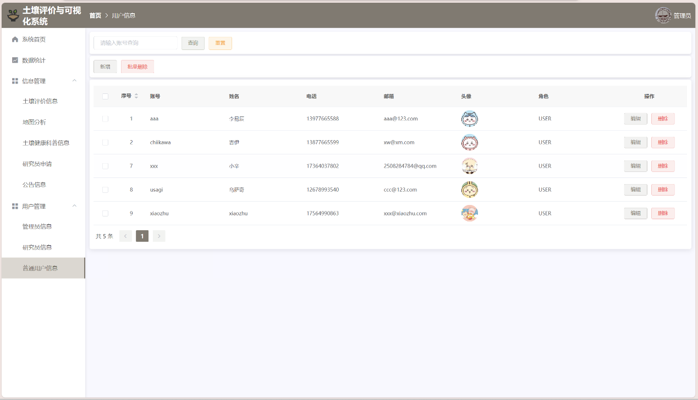

# Soil Heavy Metal Pollution Visualization System 土壤重金属污染可视化系统

A GIS-based environmental monitoring platform for evaluating and visualizing soil heavy metal pollution. This system was developed as part of my undergraduate thesis at Hubei University of Technology and aims to improve the spatial analysis and visualization of soil contamination data in China.

## Project Overview

This system integrates environmental data, spatial analysis, and visualization through GIS technologies. It supports real-time evaluation of pollution severity using recognized environmental standards and provides an interactive web interface for researchers, administrators, and general users.

The system enables users to:
- Analyze heavy metal concentration in soil using standardized pollution indices
- Visualize contamination levels through interactive maps and dashboards
- Manage and query soil data in real time
- Monitor environmental trends with temporal and spatial dimensions

## Features

- Pollution evaluation using Single-Factor and Nemerow Comprehensive Index
- Interactive GIS maps based on ArcGIS API for JavaScript
- Visual dashboard for element-wise data analysis and trends
- Role-based access control: Admin, Researcher, General User
- Real-time data querying and database management
- Fixed background values support for region-specific pollution comparison (e.g., Hubei Province)

## Tech Stack

| Layer         | Technology                                 |
|---------------|---------------------------------------------|
| Frontend      | Vue.js, ECharts, ArcGIS API for JavaScript |
| Backend       | Spring Boot, MyBatis                       |
| Database      | MySQL 5.7                                  |
| Visualization | ECharts, Datart (optional), Matplotlib     |
| Tools         | IntelliJ IDEA, Git, Postman                |

## Project Structure

```
soil-pollution-visualization/
├── backend/
│   ├── src/                      # Java source code (Spring Boot)
│   └── resources/               # Application configs, SQL files
│   └── pom.xml                  # Maven project file
├── frontend/
│   ├── public/                  # Static files
│   └── src/                     # Vue.js components, views, assets
│   └── package.json             # NPM project config
├── screenshots/                 # UI demo images
├── data/                        # Sample datasets and evaluation results
├── README.md                    # Project introduction and documentation
└── LICENSE                      # License file (optional)
```


## Sample Screenshots

### 🏠 Homepage (Role-based Views)
| Admin | Researcher | User |
|-------|------------|------|
|  |  |  |

---

### 🔐 Login & Registration
| Login | Register |
|-------|----------|
|  |  |

---

### 👤 Personal Profile Pages
| Researcher | User |
|------------|------|
|  |  |

---

### 🧪 Soil Evaluation Module
| Admin | Researcher | User |
|-------|------------|------|
|  |  |  |
| Information Reporting |
|  |

---

### 🧭 Map & Data Analysis
| Map Analysis | Data Statistics |
|--------------|-----------------|
|  |  |

---

### 📢 Announcements
| List | Search | Management |
|------|--------|------------|
|  |  |  |

---

### 🗂️ Other Functional Modules
| Change Password | Apply Researcher | Approval |
|-----------------|------------------|----------|
|  |  |  |

| Researcher Management | User Management | Admin Management |
|------------------------|-----------------|------------------|
|  |  |  |

| Popularization (View) | Edit Popularization | Manage Popularization |
|------------------------|----------------------|------------------------|
|  |  |  |

---

## System Architecture

```
Frontend (Vue.js + ArcGIS) <--> Backend API (Spring Boot) <--> MySQL Database
                       ↑                                ↓
             Interactive UI               Evaluation Algorithms
```


## Evaluation Methods
1. Single-Factor Pollution Index
Evaluates each heavy metal separately (e.g., Cd, Hg, Pb)

Easy to implement and interpret

2. Nemerow Comprehensive Pollution Index
Combines multiple pollutants using weighted averages and max values

More accurate for overall risk assessment

Reference Standard: GB 15618–1995 (Soil Environmental Quality Standard)

---
## Dataset
Background values for heavy metals in Hubei Province

Sampled data collected and simulated for testing

Evaluation benchmarks based on national standards

---

## Timeline

| Period         | Task                                              |
|----------------|---------------------------------------------------|
| Dec 2023       | Topic selection & literature review               |
| Jan–Mar 2024   | Data collection & system architecture             |
| Apr 2024       | System development                                |
| May 2024       | Testing, optimization, and thesis defense         |

---
## Future Work
- Integrate ML-based pollution prediction models
- Add real-time monitoring and alerting features
- Mobile-friendly interface and cross-platform access
- Import/export geospatial formats (Shapefiles, GeoJSON)

---
## Author
Xinyu Dai

Email: xinyudai2002.career@gmail.com
